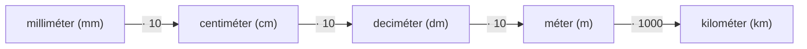

# 4. A hosszúság mérése

## Tananyag Áttekintés
A hosszúság mértékegységeinek megismerése és átváltása: milliméter, centiméter, deciméter, méter és kilométer. A vonalzó helyes használata, szakaszok hosszának pontos leolvasása és rajzolása.

---

## Hosszmértékek és Váltószámok

### 1. Alapvető Átváltások
$$1\text{ cm} = 10\text{ mm}$$
$$1\text{ dm} = 10\text{ cm} = 100\text{ mm}$$
$$1\text{ m} = 10\text{ dm} = 100\text{ cm} = 1000\text{ mm}$$
$$1\text{ km} = 1000\text{ m}$$

---

## Vonalzóhasználat és Szakaszrajzolás
1. **Kezdőpont:** A vonalzó **0** jelzését illesztjük a szakasz kezdőpontjához (nem a vonalzó szélét!).
2. **Végpont:** Leolvassuk a szakasz másik végpontjánál lévő számot és a beosztásokat.
3. **Példa:** $5\text{ cm } 7\text{ mm} = 57\text{ mm}$.
