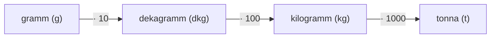

# 2. A tömeg mérése

## Tananyag Áttekintés
A tömeg fogalma, mértékegységei (gramm, dekagramm, kilogramm, tonna), az egységek közötti váltószámok, a kétkarú és digitális mérleg használata, valamint a mindennapi tömegmérések.

---

## Mértékegységek és Váltószámok

### 1. Alapvető Átváltások
$$1\text{ dkg} = 10\text{ g}$$
$$1\text{ kg} = 100\text{ dkg} = 1000\text{ g}$$
$$1\text{ t} = 1000\text{ kg}$$

### 2. Törtrészek a Mindennapokban
- **Fél kilogramm:** $\frac{1}{2}\text{ kg} = 50\text{ dkg} = 500\text{ g}$
- **Negyed kilogramm:** $\frac{1}{4}\text{ kg} = 25\text{ dkg} = 250\text{ g}$
- **Háromnegyed kilogramm:** $\frac{3}{4}\text{ kg} = 75\text{ dkg} = 750\text{ g}$

---

## Gyakorlati Példák
- $3\text{ kg } 40\text{ dkg} = 340\text{ dkg} = 3400\text{ g}$
- $250\text{ g} + 750\text{ g} = 1000\text{ g} = 1\text{ kg}$
- $4\text{ kg} - 120\text{ dkg} = 400\text{ dkg} - 120\text{ dkg} = 280\text{ dkg} = 2\text{ kg } 80\text{ dkg}$
