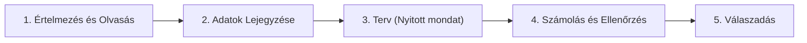

# 5. Szöveges feladatok

## Tananyag Áttekintés
A szöveges feladatok megértése, strukturált lejegyzése és lépésről lépésre történő megoldása 3. osztályos szinten: az adatok kigyűjtése, nyitott mondat (egyenlet) felírása, a számolás elvégzése, az ellenőrzés a szöveg alapján és az egyértelmű válaszadás.

---

## A Szöveges Feladat Megoldásának 5 Lépése

---

## Gyakorlati Példa

### Feladat
*Peti $3$ csomag matricát vásárolt, mindegyik csomagban $8$ matrica volt. A meglévő matricáiból még elajándékozott $6$ darabot a barátjának. Hány matricája maradt a vásároltakból?*

1. **Adatok:**
   - Csomagok száma: $3\text{ db}$
   - Matricák csomagonként: $8\text{ db}$
   - Elajándékozott: $6\text{ db}$
   - Kérdés: Maradt matricák ($M$) = ?

2. **Terv / Nyitott mondat:**
   $$M = 3 \cdot 8 - 6$$

3. **Számolás:**
   $$3 \cdot 8 = 24$$
   $$24 - 6 = 18$$

4. **Ellenőrzés:**
   $$18 + 6 = 24 \implies 24 : 3 = 8\text{ matrica csomagonként (helyes)}$$

5. **Válasz:**
   *Petinek $18$ matricája maradt.*
