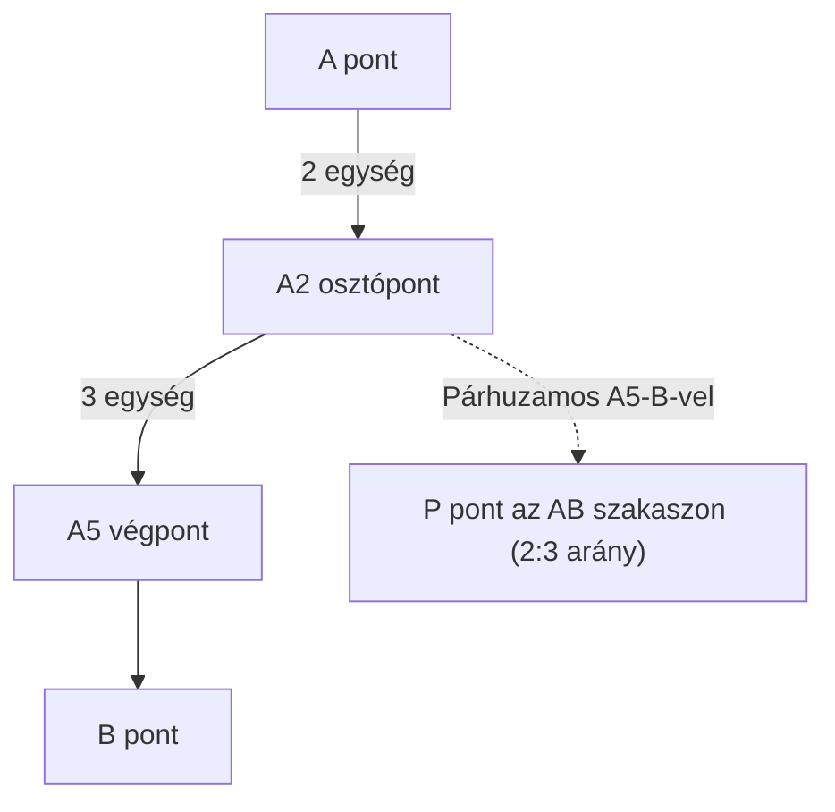

# 6. Szerkesztések (Kiegészítő tananyag) (8. osztály)

## Tananyag Áttekintés
Klasszikus szerkesztések körzővel és vonalzóval a hasonlóság és a párhuzamos szelők tételének alkalmazásával: szakasz felosztása adott arányban, negyedik arányos szerkesztése, méretarányos háromszögek és sokszögek hasonlósági szerkesztése.

---

## Alapvető Szerkesztési Eljárások

### 1. Szakasz Felosztása $n$ Egyenlő Részre vagy $m : k$ Arányban
- **Cél:** Adott egy $AB$ szakasz, osszuk fel például $2 : 3$ arányban egy $P$ ponttal.
- **Szerkesztés lépései (Párhuzamos szelők segítségével):**
  1. $A$-ból tetszőleges szögben húzunk egy $f$ segédfélegyenest.
  2. $A$-tól kiindulva körzővel egymás után felmérünk $2 + 3 = 5$ darab egyenlő $e$ egységet az $f$ félegyenesre ($A_1, A_2, A_3, A_4, A_5$).
  3. Összekötjük a végpontot $B$-vel ($A_5 B$ szakasz).
  4. Az $A_2$ osztóponton keresztül párhuzamost húzunk az $A_5 B$ egyenessel.
  5. A párhuzamos egyenes $AB$-vel vett metszéspontja adja a keresett $P$ pontot, amelyre $\frac{AP}{PB} = \frac{2}{3}$.

---

### 2. Negyedik Arányos Szakasz Szerkesztése
- **Feladat:** Adott három szakasz: $a, b, c$. Keressük azt az $x$ szakaszt, amelyre $\frac{a}{b} = \frac{c}{x}$ (azaz $x = \frac{b \cdot c}{a}$).
- **Szerkesztés lépései:**
  1. Tetszőleges szögtartomány egyik szárára felmérjük $a$-t ($OA$), majd $A$-tól folytatólagosan $b$-t ($AB$, vagyis $OB = a+b$), a másik szárra $c$-t ($OC$).
  2. Összekötjük $A$-t és $C$-t.
  3. $B$-n keresztül párhuzamost húzunk $AC$-vel; a metszéspont kijelöli a $D$ pontot, így $CD = x$.

---

### 3. Hasonló Háromszög és Sokszög Szerkesztése
- **Középpontos hasonlósággal:**
  - Kiválasztunk egy tetszőleges $O$ pontot (vagy a sokszög egyik csúcsát).
  - Az $O$-ból a csúcsokba mutató sugarakra felmérjük a $\lambda$-szoros távolságokat.
  - A kapott képpontokat összekötve megkapjuk a hasonló alakzatot.
