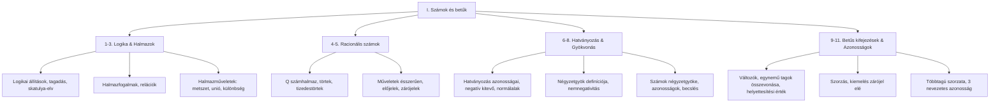

# 12. Összefoglalás – I. Számok és betűk (8. osztály)

## Tananyag Áttekintés
Az **I. Számok és betűk** fejezet teljes átfogó rendszerezése, elméleti és feladattípus-összefoglalása a témazáró dolgozatra és a 8. osztályos központi felvételire történő felkészüléshez.

---

## A Fejezet 11 Fő Pillére

---

## Kulcsképletek és Szabályok Gyűjteménye

### 1. Halmazok és Logika
- Szita-formula: $\lvert A \cup B \rvert = \lvert A \rvert + \lvert B \rvert - \lvert A \cap B \rvert$
- Részhalmazok száma: $2^n$ ($n$ elemű halmaz esetén)
- Skatulya-elv: $n$ skatulya, legalább $n+1$ tárgy $\implies$ legalább egy skatulyában $\ge 2$ tárgy.

### 2. Hatványozás és Normálalak
- $a^n \cdot a^m = a^{n+m}$
- $\frac{a^n}{a^m} = a^{n-m}$
- $(a^n)^m = a^{n \cdot m}$
- $(ab)^n = a^n b^n$, $\left(\frac{a}{b}\right)^n = \frac{a^n}{b^n}$
- $a^0 = 1 \quad (a \neq 0)$
- $a^{-n} = \frac{1}{a^n} \quad (a \neq 0)$
- Normálalak: $a \cdot 10^k \quad (1 \le a < 10, k \in \mathbb{Z})$

### 3. Négyzetgyökvonás
- $\sqrt{a} = b \iff b^2 = a$ és $a \ge 0, b \ge 0$
- $\sqrt{a^2} = \lvert a \rvert$
- $\sqrt{a \cdot b} = \sqrt{a} \cdot \sqrt{b} \quad (a \ge 0, b \ge 0)$
- $\sqrt{\frac{a}{b}} = \frac{\sqrt{a}}{\sqrt{b}} \quad (a \ge 0, b > 0)$
- $\sqrt{a + b} \neq \sqrt{a} + \sqrt{b}$!

### 4. Algebra és Nevezetes Azonosságok
- Kiemelés: $ab + ac = a(b + c)$
- Kéttagúak szorzata: $(a + b)(c + d) = ac + ad + bc + bd$
- **1. Azonosság:** $(a + b)^2 = a^2 + 2ab + b^2$
- **2. Azonosság:** $(a - b)^2 = a^2 - 2ab + b^2$
- **3. Azonosság:** $(a + b)(a - b) = a^2 - b^2$
